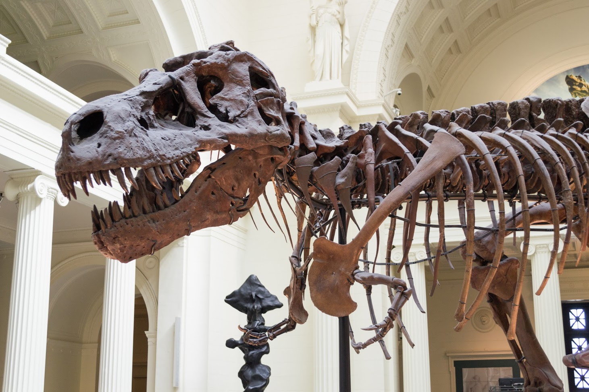
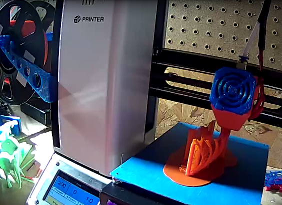
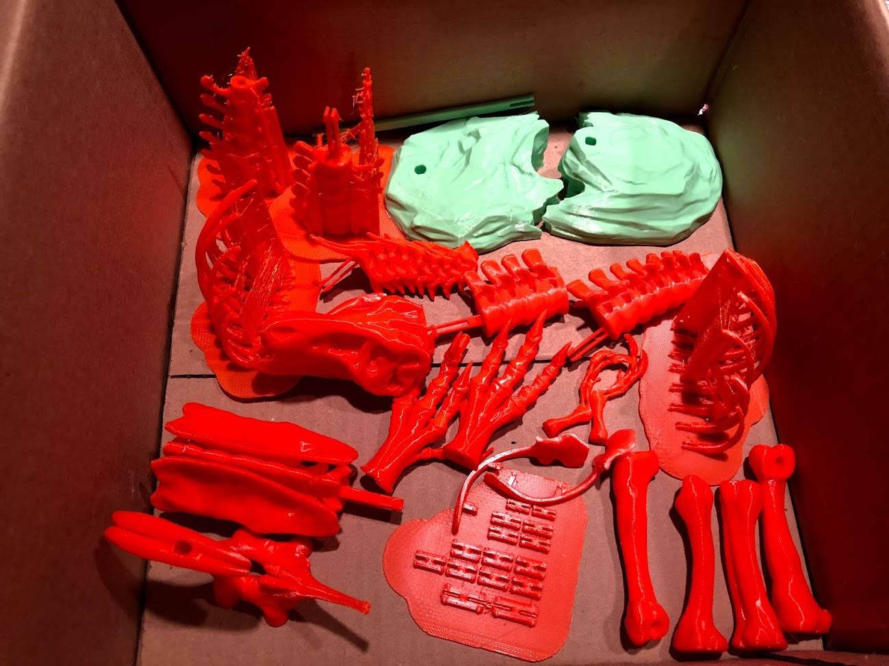

# 3D Printing A T-Rex

I've gotten into 3D printing, since about last April. Over the time since then, I've been trying to think of the best ways to use 3D printing, both the technical capability and the resulting printed objects. I've come to some early conclusions in that capacity, but one of the best possible uses I've come across is as an educational tool. I've also enjoyed the ability to print models for painting and display, so what came from my looking for models to print and just have fun with, I ran across something that has become a project for my daughter and I.

# 🦖 A Tyrannosaurus Rex

A couple of years ago, Makerbot posted a 3D printable file for a highly detailed Tyrannosaurus Rex, you can [find it on thingiverse](https://www.thingiverse.com/thing:275091). This has a great level of detail, looks really close to a proper T. Rex fossilized skeleton, and is capable of being printed on smaller print beds. My only big change is that I'm printing it in a wonderful orange color of PLA. I also find it quite ironic that I'm 3D printing a scaled version of a dinosaur in plastic. You know what they say, ashes to ashes and biodecomposed organic materials into 3D printed miniature representations of extinct creatures.

# Background

Last year in the spring, my family took a weekend trip down to Chicago. We saw [SUE (Specimen FMNH PR 2081)](https://twitter.com/SUEtheTrex) at [The Field Museum](https://www.fieldmuseum.org/at-the-field/exhibitions/sue-t-rex), as well as [Jurassic World: The Exhibition](https://www.fieldmuseum.org/at-the-field/exhibitions/jurassic-world-exhibition). Both were great, but my 3yo thought that SUE was more fun to look at, since it didn't move and didn't come with the scary experience ambiance. My wife and I had no idea the level of terror we might instill in my daughter, but we sure got to find out. Even after a kids activity room with coloring, which she really enjoyed, she kept peeking over my shoulder to see if the Indominous Rex was going to come in and cause trouble. Thankfully that "trauma" wore off after an hour and some food, so she's no worse for the wear. Parenting, good times 😅.

<Tweeter :id="'868915780779466752'" />

One thing I was happy about was that in spite of that bit of emotional scarring, my daughter still enjoyed seeing all the (non-moving) dinosaur fossils and other ancient animal exhibits, just not "the scary ones". She loves animals and going to zoos, so thankfully she was still good with things, if a little wary of some thankfully extinct creatures. The Field Museum made for a great visit and certainly was appreciated by all of us. If you get the chance to go and have not been, I recommend it.

The Field Museum lobby.

SUE's close up shot.

# 3D Printing Stats

From the Thingiverse description. My print times are likely longer, as I'm going a bit slower than average for cleaner printed parts, and sometimes using rafts which may not be needed (for additional stability).

- \# Files: 19
- \# Pieces: 79
- Estimated Total Print Time: 24hr 12min
- Dimensions: 601mm X 93mm X 247mm

# Parts List

| Status | Part                               | Status | Part                                |
|-------|-------------------------------------|--------|-------------------------------------|
| ✅    | Arms                                | ✅    | Ribs &mdash; Left                   |
| ✅    | Dorsal (Spine) &mdash; A            | ✅    | Ribs &mdash; Right                  |
| ✅    | Dorsal (Spine) &mdash; B            | ✅    | Scapulas (Shoulder Blades)          |
| ✅    | Feet                                | ✅    | Skull                               |
| ✅    | Femur + Tibia                       | ✅    | Tail A + C                          |
| ✅    | Hip (Pelvic Region) &mdash; Bottom  | ✅    | Tail B + D                          |
| ✅    | Hip (Pelvic Region) &mdash; Top     | ✅    | H Clips                             |
| ✅    | Jaw                                 | ✅    | Base &mdash; Back                   |
| ✅    | Neck                                | ✅    | Base &mdash; Front                  |

Here's an "action shot" of one of the sets of ribs being printed out.

Action shot!

Once all the parts finished printing out, I hauled my box of dinosaur parts upstairs in a box, then cleaned them up a bit, and assembled them with the tiny mammal.

A box of dinosaur parts...

# Results!

We have a T-Rex.

You must go faster!

If you want, you can view [my "make" of the model on Thingiverse](https://www.thingiverse.com/make:444581).

# Summary

All in all, we hope we did some small justice to SUE. If nothing else, it was a fun side project to do and has been captivating enough for my kid to require some superglue repairs to the finished model at least once. I'll take that as a "win" for neat factor, relevance, and fun.

Until we meet again SUE! Best of luck with the move.
