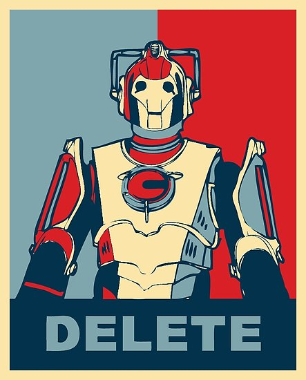

# Facebook

For better and for worse, Facebook has come to embody both the best and worst parts of the Internet. Of late, it has championed the worst parts while the best parts are minimalized, so I find myself at a decision.

The Internet itself is a technological achievement, one which all but eliminated barriers, certainly the imposition of physical or political boundaries, and is making great strides in the removal of language barriers. The Internet has excelled in decreasing points of friction, Facebook's management of their platform has shown exactly what little, if any, measures can be taken for removing or disallowing content which is any of foreign attempts at destabilizing elections and the sanctity therein, the inane ramblings or ravings of conspiracy theorists, rabid racism, or the deluded "reasoning" of flat-Earthers or anti-vaccine nuts who are [bringing about epidemics][measles-epidemic] which are both entirely avoidable and hallmarks of worse things to come.

Some time ago, when the Internet was still becoming mainstream, I heard an anecdote that has stuck with me. It goes to the effect of ~"the Internet is great in that it gives everyone an equal voice; the Internet also gives _everyone_ an equal voice." As the sharing of junk thoughts and poor reasoning are still worth the "currency" of promoting them over a reason-driven environment, it's no longer something I wish to be a part of.

UPDATE: it is done.

## Jumping Ship

For a while, I've been considering getting rid of my Facebook account. Aside from my news feed generally being full of drivel of various sorts, the only real hold out reasons I have kept my account have been 1. to support a business page of a family member, 2. to maintain connection to some people I don't speak to very often, or 3. retain access to some groups. The fact of the matter is that each of these have become excuses which are holding me back from moving on from Facebook.

Some basic realizations come to mind. I don't need to support any pages anymore, as I haven't needed to do anything with them over the last couple years. If I don't speak to people already, what's going to change in the next year? Lastly, we had plenty of group formats before Facebook, so regardless of the convenience of having them on a platform I already had an account on is all the more self-serving in its redundance.

## Why Not Inactivate Instead

I won't be disabling my account, as this does nothing to send the right message to Facebook. Instead I will be deleting my account and its respective content. Aside from having no immediate use, the only reason Facebook has to "give" someone a "free" account is inherent to the form by which they extract their price. The information about and of its users are the currency of Facebook. The situation exposed by the discovery of the [Cambridge Analytica][wiki-ca] leaks is only the beginning of what is to be a flood in the near future, with few to none at Facebook apparently concerned for the safety, securing, and well being of the respective personal information of its users.

Facebook continues to not address the false information, faked (deep or otherwise) content such as videos, blatantly targeted ads that seek to drive people apart, and attempts to influence peoples' opinions and their voting habits. It's not that they can't do anything, they just don't care to. There have been moments when they make statements saying "please regulate us", but the fact of the matter is they know American politics is so ineffective these days, and politicians so clueless in the ways of technology, that they will never do anything about it.

What's more, there has been no "one-off" occurrence of Facebook capitalizing on their acquisition of peoples' information. They've been at it long enough, looking beyond merely advertizing at their users as a source of revenue. What bothers me increasingly is their flaunting of their apparent lack of regulation in the face of Congressional inquiries, but worse their lack of respect for the [rule of law and authority of our own][zuck-us-congress] and [other respectable nations][cbc-fb] when they justly seek answers. Zuck has shown he won't properly answer our Congressional leaders' questions without being evasive, at best. This week, failing to appear at Canada's House of Commons panel, instead sending two lackeys in the place of Zuckerberg or Sandberg, after similarly refusing to show in London for a similar body, shows a consistent policy. Avoid and deflect with the expectation of continuing to fleece their cash cow users.

To top all of this off, there's the personal toll that something like Facebook elicits. Whether it's our mental health or just plain amount of time in our day, it extracts a certain cost from us. I want my information free from Facebook's clutches and my time back in my day, so that helps make this decision for me pretty easily.

## A Warning

This is it, I won't be posting any more articles or how-tos on how to take care of your personal privacy on Facebook. So long as Facebook and others go unchecked, we are all at risk. This is me saying you should probably consider jumping off Facebook's carousel of insanity.

If you find yourself mentally replying, "but what else is there for all this?" it's possible you've missed the point. This is a false economy, under the guise of connecting people, [peddling our personal information for the profit of others without our informed consent][fb-nyt]. Every time you take some personality quiz and share how funny the results are, you're being data mined. Every time your phone is powered on, you're likely being data mined. This includes those of us that value the semi-protected "walled garden" of iOS, since so long as background app refresh is enabled, [who knows what your Facebook app is sending off to its servers][fb-bg].

If you're considering deleting your Facebook account or even just wanting to learn more about digital privacy in the age of omnipresent social media, I recommend the following resources:

- the [EFF's (Electronic Frontier Foundation) page on social networks][eff-social]
- the EFF in general does a great job as a non-profit advocating for personal rights and privacy in the digital age, they're worth supporting
- [DeleteFacebook.com][delete-fb], which seeks to keep an up to date set of information on how to go about deleting a facebook account
  - such recommended steps include:
    - downloading your information record
    - removing connected app permissions
    - notifying friends/family of your pending removal

## Deletion

From this point on, treat me as non-existent on Facebook. I'll be slowly pulling my content and knocking things down into oblivion. This goes for Facebook and Messenger, in fact I've already deleted the main Facebook app from my phone. I expect the full deletion may take upwards of a week or two, but it begins now.

Facebook, the time has come for us to go our separate ways.

<a href="https://sweartrek.tumblr.com/post/182460924601">source: Swear Trek</a>

## Summary

So, without much further thought, I am closing down my Facebook account and will over the next month be deleting it outright.

If you're concerned about being able to follow and/or get ahold of me. I'm still, currently, on:

- [<i class="fa fa-fw fa-twitter"></i>twitter][tweeter], which is short form and not the hell hole many try to make it seem like; you don't _need to_ follow any accounts except those that interest you
- [<i class="fa fa-fw fa-instagram"></i>instagram][ig], which is my favorite social media site, we'll see how long that holds since Facebook purchased them
- [<i class="fa fa-fw fa-linkedin"></i>linkedin][linkedin], it's connection, so yeah...

If you have a GitHub account, you can [submit questions on my AMA][ama], or you can contact me [via a contact form (edm00.se/contact)][contact-form].

[measles-epidemic]: https://www.npr.org/sections/health-shots/2019/04/30/718220586/is-measles-here-to-stay
[wiki-ca]: https://en.wikipedia.org/wiki/Cambridge_Analytica
[zuck-us-congress]: https://www.npr.org/sections/thetwo-way/2018/04/11/599590470/mark-zuckerberg-is-back-before-congress-for-a-second-day-of-testimony
[cbc-fb]: https://www.cbc.ca/news/politics/facebook-contempt-parliament-1.5145347
[fb-nyt]: https://www.nytimes.com/2018/04/11/technology/facebook-privacy-hearings.html
[fb-bg]: https://www.washingtonpost.com/technology/2019/05/28/its-middle-night-do-you-know-who-your-iphone-is-talking/?noredirect=on
[eff-social]: https://www.eff.org/issues/social-networks
[delete-fb]: https://deletefacebook.com/
[tweeter]: https://twitter.com/edm00se
[ig]: https://twitter.com/edm00se
[linkedin]: https://www.linkedin.com/in/emccormick
[ama]: https://github.com/edm00se/ama
[contact-form]: https://edm00.se/contact
